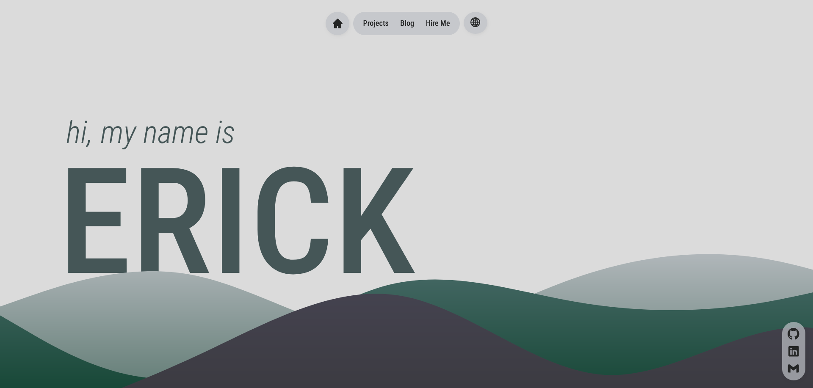

[](https://erickfrederick.com)

# portfolio

### tl;dr

```
git clone https://github.com/pepeien/portfolio.git
cd portfolio/
npm install
npm run dev
```

Then open [http://localhost:3000/](http://localhost:3000/) to see your app. The initial structure of your app is setup. You may need to add a few `.env` variables read **Adding environment variables** for more.

### Adding environment variables

|  Variable  | Description                       |  Type   | Required |
| :--------: | :-------------------------------  | :-----: | :------: |
| FETCH_REVALIDATION_INTERVAL  | Revalidation interval in seconds | String |    ✅    |
| DEPLOYMENT_URL               | Deployment URL                   | String |    ✅    |
| NEXT_PUBLIC_FORM_SERVICE_URL | Form service URL                 | String |    ✅    |
| INITIAL_VALUE                | Secret value                     | String |    ✅    |
| NEXT_PUBLIC_GIT_URL          | Git plataform URL                | String |    ✅    |
| NEXT_PUBLIC_LINKEDIN_URL     | Linkedin URL                     | String |    ✅    |
| NEXT_PUBLIC_EMAIL_URL        | Email URL                        | String |    ✅    |
| TWITTER_HANDLE               | Twitter handle                   | String |    ✅    |
| BLOB                          | App data BLOB                     | String |    ✅    |
| GIT_BLOB                      | Repo data BLOB                    | String |    ✅    |

### Localization

Locales supported by the application:

- `en-us`;
- `ja-jp`;
- `pt-br`.

#### Jobs Localization

- A entry at `src/app/[lang]/dictionaries/personal/*.ts` will need to follow this template:
  
```js
{
    jobs: {
        {JOB_COMPANY_NAME}: {
            description: string;
        }
    }
}
```

#### Blog Localization

- A entry at `src/app/[lang]/dictionaries/personal/*.ts` will need to follow this template:
  
```js
{
    blog: {
        {BLOG_POST_ID}: {
            title: string;
            description: string;
        }
    }
}
```

#### Projects Localization

- A entry at `src/app/[lang]/dictionaries/personal/*.ts` will need to follow this template:
  
```js
{
    projects: {
        {PROJECT_NAME}: {
            description: string;
        }
    }
}
```

### Blob

This is the Blob structure

#### Jobs Blob

- A file at `{BLOB}/jobs/metadata.json` will need to follow this template:

```json
[
    {
        "startDate":    {JOB_START_DATE}       [string] (YYYY-MM-DD),
        "endDate":      {JOB_START_DATE}       [string] (YYYY-MM-DD) - OPTIONAL,
        "company":      {JOB_COMPANY_NAME}     [string],
        "positions":    {JOB_POSITION_HISTORY} [string[]],
        "technologies": {JOB_TECHNOLOGIES}     [string[]]
    }
]
```

#### Blog Blob

- A file at `{BLOB}/blog/metadata.json` will need to follow this template:

```json
[
    {
        "id":     {BLOG_POST_ID}     [string],
        "author": {BLOG_POST_AUTHOR} [string],
        "theme":  {BLOG_POST_THEME}  [string],
        "date":   {BLOG_POST_DATE}   [string] (YYYY-MM-DDTHH:MM:SSSZ)
    }
]
```

- Create `.md` files inside `{BLOB}/blog/{BLOG_POST_ID}/{LOCALE}.md` named after the [Locales](#localization).

#### Projects Blob

- A file on each or the projects at `.git/metadata.json` will need to follow this template:

```json
{
    "primaryColor": {HEX_VALUE_COLOR_STRING} [string],
    "accentColor":  {HEX_VALUE_COLOR_STRING} [string]
}
```

- A file at `{BLOB}/PROJECTS/metadata.json` will need to follow this template:

```json
[
    {
        "name":         {PROJECT_NAME}         [string],
        "repo":         {PROEJCT_REPO}         [string],
        "technologies": {PROJECT_TECHNOLOGIES} [string[]]
    }
]
```

Now you are ready to use the project, just issue a `npm run dev` and you're good to go

## About the Project

This project it's my portfolio page, always beign updated.

## Development

Install dependencies:

```sh
npm install
```

```sh
npm run dev
```
